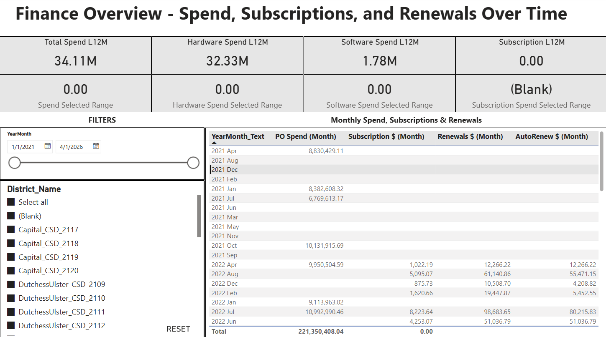
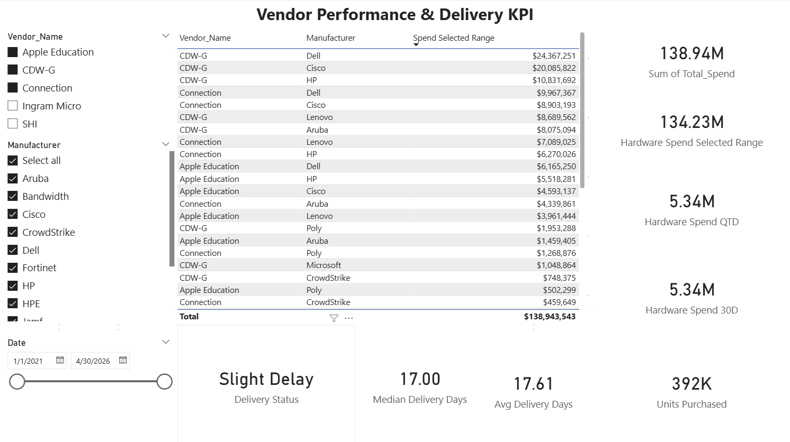
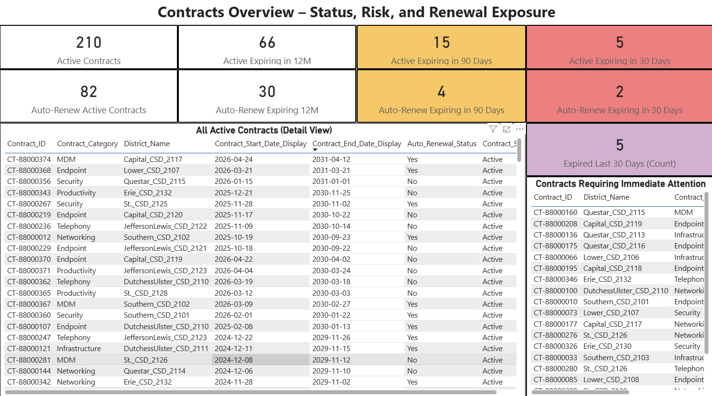
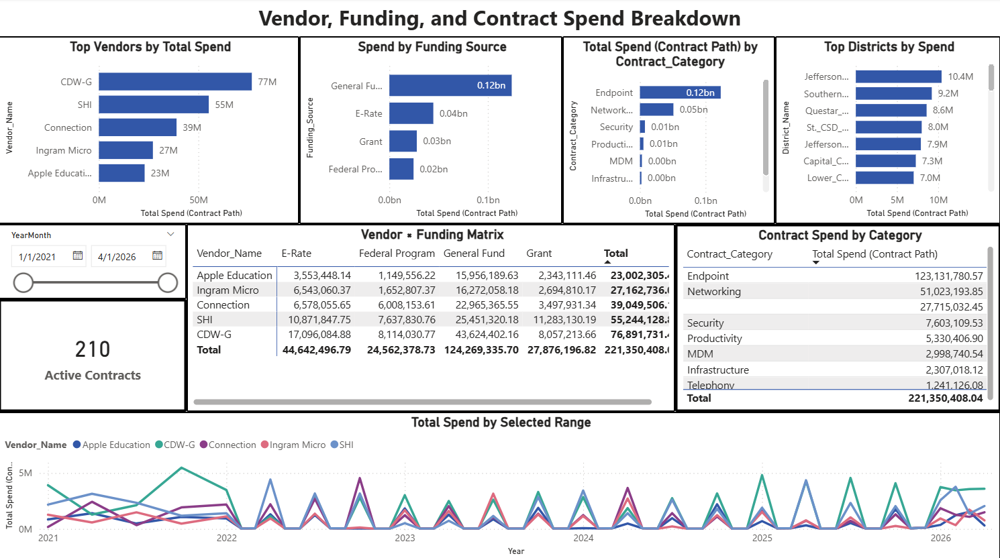

# Procurement & Contract Risk Dashboard

Power BI portfolio project focused on procurement, contract risk, software licensing, hardware asset visibility, funding, and vendor purchasing performance.

## Current Status

- Power BI file recovered and staged: `Procurement_Contract_Risk_Dashboard.pbix`
- Source CSV files recovered from the original Power BI source references and copied into `data/raw`.
- Monthly refresh generator created in `scripts/generate_monthly_refresh.py`.
- January through April 2026 update packages generated in `data/monthly_updates`.
- Refresh-ready current dataset generated in `data/current`.
- Power BI source paths were manually updated to the current April 2026 snapshot.
- The report calendar/date slicer has been manually adjusted for the static April 2026 close.
- Report pages detected from the PBIX: Finance, Funding, Contracts, Vendor KPI (PO Based).
- Data model appears to support an education IT procurement scenario with districts, schools, classrooms, purchases, contracts, licenses, hardware assets, software entitlements, vendors, and date dimensions.
- Notion/Super case study content is updated and no longer a placeholder.

## Business Problem

Procurement and operations leaders need a clearer way to monitor purchasing activity, contract exposure, funding utilization, vendor concentration, and technology asset risk. This dashboard is intended to show where money is being spent, which vendors or contracts may need attention, and how procurement activity connects to schools, departments, assets, and software/license obligations.

## Portfolio Angle

This project demonstrates the ability to translate operational procurement data into a business-facing Power BI dashboard and maintain it through a recurring monthly refresh process. The strongest framing is not "a Power BI report," but a procurement decision-support layer that helps users track spend, contracts, assets, vendors, and funding risk over time.

## Monthly Refresh Workflow

The recovered 2021-2025 synthetic BOCES procurement dataset is treated as the historical baseline. A repeatable refresh script generates monthly update packages for 2026 and appends them into a current refresh-ready dataset.

Backfilled update months:

- 2026-01
- 2026-02
- 2026-03
- 2026-04

Current QA result:

- Current date dimension extends through 2026-04-30.
- Purchase orders, hardware purchases, software starts, and contract starts now include 2026 activity.
- Purchase lines reconcile to purchase headers.
- Primary IDs are unique across the current dataset.

See:

- `docs/monthly_refresh_log.md`
- `docs/monthly_refresh_qa.md`
- `docs/monthly_refresh_automation_runbook.md`
- `docs/metric_definitions.md`
- `docs/key_insights.md`
- `docs/screenshot_qa_notes.md`

## Key Results

- Total spend: approximately **$221.35M**.
- Hardware spend: approximately **$213.02M**.
- License/software spend: approximately **$8.33M**.
- Top vendor: **CDW-G** at approximately **$76.89M**.
- Active contracts: **210**.
- Active contracts expiring in 12 months: **66**.
- Active contracts expiring in 90 days: **15**.
- Active contracts expiring in 30 days: **5**.
- Reporting snapshot: static April 2026 close.

## Dashboard Screenshots

Power BI file: [Procurement_Contract_Risk_Dashboard.pbix](Procurement_Contract_Risk_Dashboard.pbix)

### Finance Overview

### Vendor, Funding, and Contract Spend Breakdown

### Contracts Overview - Status, Risk, and Renewal Exposure

### Vendor Performance & Delivery KPI

## Future Polish

1. Improve Finance month sorting so monthly rows display chronologically.
2. Add a Power BI Service/public dashboard link if available.
3. Add a short walkthrough video or GIF if a recruiter-facing demo asset is needed.

## Source Data Note

The original recovered source CSVs are staged under `data/raw/Dimensions` and `data/raw/Facts`. The refresh-ready current CSVs are staged under `data/current`. See `docs/raw_data_profile.md` and `docs/monthly_refresh_qa.md` for row counts and date coverage.
